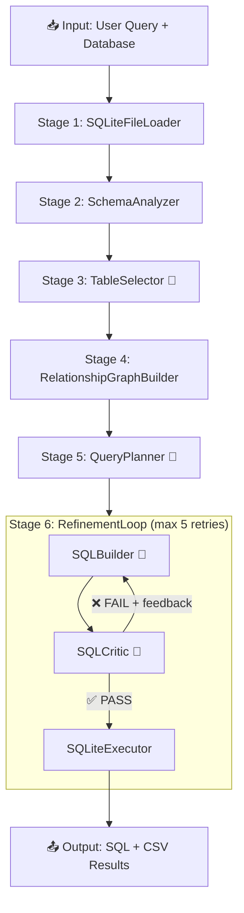

# TT_SQL Pipeline Architecture

## Pipeline Flow



> 🤖 = LLM call

---

## Agents

| # | Agent | File | Prompt | LLM? | Purpose |
|---|-------|------|--------|------|---------|
| 1 | `SQLiteFileLoader` | `input_layer.py` | — | No | Locates `.sqlite` database file |
| 2 | `SchemaAnalyzer` | `input_layer.py` | — | No | Extracts full schema (tables, columns, types, FKs) |
| 3 | `TableSelector` | `input_layer.py` | `table_selector.yaml` | **Yes** | Picks relevant tables + classifies intent & complexity |
| 4 | `RelationshipGraphBuilder` | `planning_layer.py` | — | No | Builds FK relationship graph between selected tables |
| 5 | `QueryPlanner` | `planning_layer.py` | `query_planner.yaml` | **Yes** | Breaks query into step-by-step action plan |
| 6 | `SQLBuilder` | `generation_layer.py` | `sql_builder.yaml` | **Yes** | Generates SQL from plan + schema + critic feedback |
| 7 | `SQLCritic` | `critic_layer.py` | `sql_critic.yaml` | **Yes** | Validates SQL logic (no execution, pure analysis) |
| 8 | `SQLiteExecutor` | `execution_layer.py` | — | No | Executes final SQL, saves `.sql` + `.csv` |
| 9 | `RefinementLoop` | `loop_layer.py` | — | No | Orchestrates Builder→Critic loop (max 5 retries) |

---

## Data Flow

```
User Query
    │
    ▼
┌─────────────────────────────────────────────────┐
│  INPUT LAYER                                     │
│  SQLiteFileLoader → SchemaAnalyzer → TableSelector│
│                                                   │
│  Outputs:                                         │
│  ├── schema_info (full DB schema)                │
│  ├── relevant_tables (filtered subset)           │
│  ├── query_intent (AGGREGATION, RANKING, etc.)   │
│  └── complexity (LOW / MEDIUM / HIGH)            │
└─────────────────────┬───────────────────────────┘
                      │
                      ▼
┌─────────────────────────────────────────────────┐
│  PLANNING LAYER                                  │
│  RelationshipGraphBuilder → QueryPlanner         │
│                                                   │
│  Outputs:                                         │
│  ├── relationship_graph (FK connections)          │
│  └── step_by_step_plan (numbered action steps)   │
└─────────────────────┬───────────────────────────┘
                      │
                      ▼
┌─────────────────────────────────────────────────┐
│  GENERATION LAYER (RefinementLoop)               │
│                                                   │
│  ┌──────────┐    feedback    ┌──────────┐        │
│  │SQLBuilder│◄──────────────│SQLCritic  │        │
│  │          │───────────────►│          │        │
│  └──────────┘   generated    └──────────┘        │
│       ▲              SQL           │              │
│       │                        ✅ PASS            │
│       └── retry (max 5)           │              │
│                                   ▼              │
│                          ┌──────────────┐        │
│                          │SQLiteExecutor│        │
│                          └──────────────┘        │
└─────────────────────────────────────────────────┘
```

---

## Key Design Decisions

### Schema Filtering
Only **relevant tables** (selected by `TableSelector`) are sent to `SQLBuilder` and `SQLCritic` — not the entire database schema. This saves tokens on large databases.

### Intent Classification (No Extra LLM Call)
`TableSelector` classifies **intent** and **complexity** in the same LLM call that picks tables:
- **Intent**: `DATA_RETRIEVAL` | `AGGREGATION` | `COMPARISON` | `RANKING` | `TREND_ANALYSIS`
- **Complexity**: `LOW` | `MEDIUM` | `HIGH`

### Critic-First, Execute-Last
SQL is **never executed** during the refinement loop. The `SQLCritic` validates pure SQL logic against the schema. Execution happens **only once**, after the critic approves.

### Critic Failure Categories
The `SQLCritic` checks 9 categories per critique:

| Category | What It Catches |
|----------|----------------|
| LOGIC | Wrong JOINs, GROUP BY, filters |
| HALLUCINATION | Non-existent tables/columns |
| REASONING | Misunderstood user intent |
| MATH | Integer division, wrong formula |
| SCHEMA | Wrong table choice, ignored FKs |
| OUTPUT | Missing/extra columns |
| CASE | Missing `LOWER()` on string comparisons |
| SYNTAX | SQL syntax errors |
| FORMATTING | Date/type format issues |

---

## File Structure

```
src/tt_sql/
├── agents/
│   ├── input_layer.py         # SQLiteFileLoader, SchemaAnalyzer, TableSelector
│   ├── planning_layer.py      # RelationshipGraphBuilder, QueryPlanner
│   ├── generation_layer.py    # SQLBuilder (MultiCandidateGenerator)
│   ├── critic_layer.py        # SQLCritic
│   ├── execution_layer.py     # SQLiteExecutor
│   ├── loop_layer.py          # RefinementLoop orchestrator
│   └── failure_analysis_agent.py  # Post-mortem analysis (offline)
├── prompts/
│   ├── table_selector.yaml    # TableSelector prompt
│   ├── query_planner.yaml     # QueryPlanner prompt
│   ├── sql_builder.yaml       # SQLBuilder prompt
│   ├── sql_critic.yaml        # SQLCritic prompt
│   └── failure_analysis.yaml  # Failure analysis prompt
├── core/
│   ├── pipeline_runner.py     # Main pipeline orchestrator
│   ├── agent_base.py          # BaseAgent class + AgentState
│   ├── llm_service.py         # LLM API wrapper (Bedrock/OpenAI)
│   ├── prompt_loader.py       # YAML prompt loader with variable substitution
│   ├── state.py               # Pipeline state definitions
│   ├── paths.py               # Centralized path constants
│   ├── logger.py              # Markdown log writer
│   └── file_coordinator.py    # File I/O coordination
└── rag/                       # Optional RAG/vector store integration
```

---

## LLM Call Count

| Pipeline Stage | LLM Calls |
|---|---|
| TableSelector (tables + intent + complexity) | 1 |
| QueryPlanner (action plan) | 1 |
| SQLBuilder (per attempt) | 1 |
| SQLCritic (per attempt) | 1 |
| **Minimum (1 attempt)** | **4** |
| **Maximum (5 retries)** | **12** |
