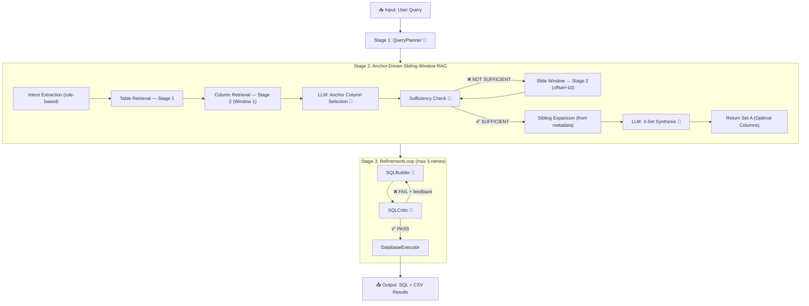

# TT_SQL Pipeline Architecture

## Pipeline Flow



> 🤖 = LLM call

---

## Agents

| # | Agent | File | Prompt | LLM? | Purpose |
|---|-------|------|--------|------|---------| 
| 1 | `QueryPlanner` | `planning_layer.py` | `query_planner.yaml` | **Yes** | Breaks the natural language query into a logical, schema-agnostic step-by-step action plan |
| 2 | `ContextEnrichmentAgent` | `input_layer.py` | — | No | Calls `VectorStoreAgent` to run the full RAG pipeline and returns refined schema columns |
| 3 | `VectorStoreAgent` | `rag/vector_store.py` | — | **Yes (3–5 calls)** | Anchor-Driven Sliding Window RAG — retrieves, filters, and synthesizes the optimal schema context |
| 4 | `SQLBuilder` | `generation_layer.py` | `sql_builder.yaml` | **Yes** | Generates SQL from the generated plan + retrieved RAG schema + critic feedback |
| 5 | `SQLCritic` | `critic_layer.py` | `sql_critic.yaml` | **Yes** | Validates SQL logic against the RAG schema (no execution, pure analysis) |
| 6 | `PostgresExecutor` | `execution_layer.py` | — | No | Executes final SQL against the target database, saves `.sql` + `.csv` |
| 7 | `RefinementLoop` | `loop_layer.py` | — | No | Orchestrates Builder→Critic loop (max 5 retries) |

---

## RAG Sub-Pipeline (VectorStoreAgent)

```
User Query
    │
    ▼
┌─────────────────────────────────────────────────────────┐
│  STAGE 1 — INTENT & TABLE RETRIEVAL                     │
│  ► extract_intent()  — rule-based keyword & op parsing  │
│  ► resolve_domain()  — domain_map.json table allowlist  │
│  ► HTTP POST /points/query (chunk_type=table)           │
│  ► filter_by_score_dropoff() → top-3 tables             │
└───────────────────────┬─────────────────────────────────┘
                        │
                        ▼
┌─────────────────────────────────────────────────────────┐
│  STAGE 2 — SLIDING WINDOW COLUMN RETRIEVAL              │
│  Window 1 (offset=0): top-10 column chunks per table    │
│  ► LLM: get_llm_anchor_columns() → "anchor" identifiers │
│                                                         │
│  Window 2–4 (offset+=10):                              │
│  ► LLM: check_schema_sufficiency() → YES / NO          │
│  ► If NO: fetch next page, apply drop-off filter        │
│  ► If YES: break                                        │
└───────────────────────┬─────────────────────────────────┘
                        │
                        ▼
┌─────────────────────────────────────────────────────────┐
│  STAGE 3 — EXPANSION & MULTI-SET SYNTHESIS              │
│  ► expand_with_siblings() — pull all columns for anchor │
│    tables from metadata_injestion_files.json            │
│  ► LLM: finalize_columns_with_llm_multi()              │
│    → Set A (Optimal), Set B, Set C (Alternatives)       │
│  ► Return Set A as List[Dict] to ContextEnrichment      │
└─────────────────────────────────────────────────────────┘
```

**HTTP Transport:** All Qdrant queries use direct REST (`POST /collections/{name}/points/query`) with `"using": "text_embedding"` for named vectors. No `qdrant_client` SDK required at runtime.

---

## Data Flow

```
User Query
    │
    ▼
┌─────────────────────────────────────────────────┐
│  PLANNING LAYER                                  │
│  QueryPlanner                                    │
│                                                  │
│  Outputs:                                        │
│  └── step_by_step_plan (schema-agnostic steps)  │
└─────────────────────┬───────────────────────────┘
                      │
                      ▼
┌─────────────────────────────────────────────────┐
│  CONTEXT ENRICHMENT LAYER (Anchor-Driven RAG)   │
│  ContextEnrichmentAgent → VectorStoreAgent       │
│                                                  │
│  Outputs:                                        │
│  ├── schema_info (Set A: optimal columns)        │
│  └── anchors (primary filter/metric columns)     │
└─────────────────────┬───────────────────────────┘
                      │
                      ▼
┌─────────────────────────────────────────────────┐
│  GENERATION & EXECUTION LAYER (RefinementLoop)  │
│                                                  │
│  ┌──────────┐    feedback    ┌──────────┐        │
│  │SQLBuilder│◄──────────────│SQLCritic  │        │
│  │          │───────────────►│          │        │
│  └──────────┘   generated    └──────────┘        │
│       ▲              SQL           │              │
│       │                        ✅ PASS            │
│       └── retry (max 5)           │              │
│                                   ▼              │
│                          ┌────────────────┐      │
│                          │DatabaseExecutor│      │
│                          └────────────────┘      │
└─────────────────────────────────────────────────┘
```

---

## Key Design Decisions

### Anchor-Driven RAG
Rather than returning a flat top-K result, the pipeline identifies **anchor columns** (primary filters, metrics, dates) first, then expands their full sibling context. This ensures the SQL builder always gets the most logically complete schema context.

### Sliding Window for Missing Context
The pipeline iteratively fetches deeper pages (`offset=10, 20, 30…`) from Qdrant until a Bedrock LLM confirms the schema context is sufficient. This prevents under-fetching for complex multi-join queries.

### Multi-Set Synthesis
Three alternative column sets (A/B/C) are generated per query. **Set A** (optimal) is returned by default. A/B/C can be used for multi-candidate SQL generation.

### Critic-First, Execute-Last
SQL is **never executed** during the generation step. The `SQLCritic` validates pure SQL logic against the schema. Execution happens within the `RefinementLoop`, where runtime SQL errors are caught and fed back into `SQLBuilder`.

### Critic Failure Categories
The `SQLCritic` checks 12 categories per critique:

| Category | What It Catches |
|----------|----------------|
| LOGIC | Wrong JOINs, GROUP BY, filters |
| HALLUCINATION | Non-existent tables/columns |
| REASONING | Misunderstood user intent |
| MATH | Integer division, wrong formula |
| SCHEMA | Wrong table choice, ignored FKs |
| OUTPUT | Missing/extra columns |
| CASE | Missing `LOWER()` on string comparisons |
| SYNTAX | SQL syntax errors |
| FORMATTING | Date/type format issues |
| DATA TYPE SAFETY | Missing conversions (e.g. `TO_DATE`) |
| TYPE COMPATIBILITY | Comparing text to dates |
| DB COMPATIBILITY | SQLite vs PostgreSQL syntax errors |

---

## File Structure

```
src/tt_sql/
├── agents/
│   ├── input_layer.py         # ContextEnrichmentAgent
│   ├── planning_layer.py      # QueryPlanner
│   ├── generation_layer.py    # SQLBuilder (MultiCandidateGenerator)
│   ├── critic_layer.py        # SQLCritic
│   ├── execution_layer.py     # DatabaseExecutor (PostgresExecutor)
│   ├── loop_layer.py          # RefinementLoop orchestrator
│   └── failure_analysis_agent.py  # Post-mortem analysis (offline)
├── prompts/
│   ├── query_planner.yaml     # QueryPlanner prompt
│   ├── sql_builder.yaml       # SQLBuilder prompt
│   ├── sql_critic.yaml        # SQLCritic prompt
│   └── failure_analysis.yaml  # Failure analysis prompt
├── rag/
│   └── vector_store.py        # VectorStoreAgent — Anchor-Driven RAG
├── core/
│   ├── pipeline_runner.py     # Main pipeline orchestrator
│   ├── agent_base.py          # BaseAgent class + AgentState
│   ├── llm_service.py         # LLM API wrapper (Bedrock/OpenAI)
│   ├── prompt_loader.py       # YAML prompt loader
│   ├── state.py               # Pipeline state definitions
│   ├── paths.py               # Centralized path constants
│   ├── logger.py              # Markdown log writer
│   └── file_coordinator.py    # File I/O coordination
└── utils/
    └── test_rag_direct.py     # Standalone RAG test harness
data/
├── metadata_injestion_files.json  # Table + column metadata
├── domain_map.json                # Domain → table allowlist
├── sample.jsonl                   # Test question bank
└── gold/                          # Gold SQL + CSV results
```

---

## LLM Call Count

| Pipeline Stage | LLM Calls |
|---|---|
| QueryPlanner | 1 |
| VectorStoreAgent — Anchor Selection | 1 |
| VectorStoreAgent — Sufficiency Check (per window) | 1–4 |
| VectorStoreAgent — Multi-Set Synthesis | 1 |
| SQLBuilder (per attempt) | 1 |
| SQLCritic (per attempt) | 1 |
| **Minimum (1 attempt, schema sufficient in Window 1)** | **7** |
| **Maximum (5 retries + 4 windows)** | **17** |
