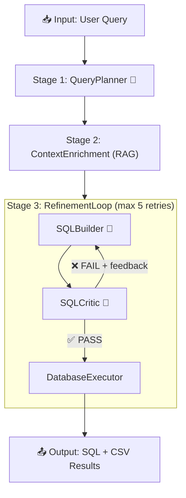

# TT_SQL Pipeline Architecture

## Pipeline Flow



> 🤖 = LLM call

---

## Agents

| # | Agent | File | Prompt | LLM? | Purpose |
|---|-------|------|--------|------|---------|
| 1 | `QueryPlanner` | `planning_layer.py` | `query_planner.yaml` | **Yes** | Breaks the natural language query into a logical, schema-agnostic step-by-step action plan |
| 2 | `ContextEnrichmentAgent` | `input_layer.py` | — | No | Combines the user query and the planner's approach to perform a semantic vector search (RAG) in Qdrant, retrieving top K relevant schema columns |
| 3 | `SQLBuilder` | `generation_layer.py` | `sql_builder.yaml` | **Yes** | Generates SQL from the generated plan + retrieved RAG schema + critic feedback |
| 4 | `SQLCritic` | `critic_layer.py` | `sql_critic.yaml` | **Yes** | Validates SQL logic against the RAG schema (no execution, pure analysis) |
| 5 | `SQLiteExecutor` / `PostgresExecutor` | `execution_layer.py` | — | No | Executes final SQL against the target database, saves `.sql` + `.csv` |
| 6 | `RefinementLoop` | `loop_layer.py` | — | No | Orchestrates Builder→Critic loop (max 5 retries), running execution inside the loop to catch runtime SQL errors |

---

## Data Flow

```
User Query
    │
    ▼
┌─────────────────────────────────────────────────┐
│  PLANNING LAYER                                  │
│  QueryPlanner                                    │
│                                                   │
│  Outputs:                                         │
│  └── step_by_step_plan (schema-agnostic steps)   │
└─────────────────────┬───────────────────────────┘
                      │
                      ▼
┌─────────────────────────────────────────────────┐
│  CONTEXT ENRICHMENT LAYER (RAG)                  │
│  ContextEnrichmentAgent                          │
│                                                   │
│  Outputs:                                         │
│  ├── schema_info (semantic column metadata)      │
│  └── relevant_tables (filtered subset)           │
└─────────────────────┬───────────────────────────┘
                      │
                      ▼
┌─────────────────────────────────────────────────┐
│  GENERATION & EXECUTION LAYER (RefinementLoop)   │
│                                                   │
│  ┌──────────┐    feedback    ┌──────────┐        │
│  │SQLBuilder│◄──────────────│SQLCritic  │        │
│  │          │───────────────►│          │        │
│  └──────────┘   generated    └──────────┘        │
│       ▲              SQL           │              │
│       │                        ✅ PASS            │
│       └── retry (max 5)           │              │
│                                   ▼              │
│                          ┌────────────────┐      │
│                          │DatabaseExecutor│      │
│                          └────────────────┘      │
└─────────────────────────────────────────────────┘
```

---

## Key Design Decisions

### Schema Filtering
Only **relevant tables** (selected by `TableSelector`) are sent to `SQLBuilder` and `SQLCritic` — not the entire database schema. This saves tokens on large databases.

### Intent Classification (No Extra LLM Call)
### Intent Classification
When the RAG path is taken (`ContextEnrichmentAgent`), intent and complexity are efficiently defaulted to `DATA_RETRIEVAL` and `MEDIUM`, bypassing the need for an extra LLM call to classify the query. 

### RAG Table Retrieval Bypass (Fast Path)
Users can execute with `--use-rag` to completely **bypass** the `TableSelector` LLM call. When active, `ContextEnrichmentAgent` will query the specified Vector Store (`rag_source="qdrant"` or `"bedrock"`) to perform a semantic search utilizing a combination of the user's natural language query AND the step-by-step logical plan generated by `QueryPlanner`. This enriched search payload retrieves the most relevant columns with high precision.

### Critic-First, Execute-Last
SQL is **never executed** during the generation step. The `SQLCritic` validates pure SQL logic against the schema. Execution happens within the `RefinementLoop`, where runtime SQL errors are caught and fed back into the `SQLBuilder` for correction.

### Critic Failure Categories
The `SQLCritic` checks 12 categories per critique:

| Category | What It Catches |
|----------|----------------|
| LOGIC | Wrong JOINs, GROUP BY, filters |
| HALLUCINATION | Non-existent tables/columns |
| REASONING | Misunderstood user intent |
| MATH | Integer division, wrong formula |
| SCHEMA | Wrong table choice, ignored FKs |
| OUTPUT | Missing/extra columns |
| CASE | Missing `LOWER()` on string comparisons |
| SYNTAX | SQL syntax errors |
| FORMATTING | Date/type format issues |
| DATA TYPE SAFETY | Missing conversions (e.g. `TO_DATE`) |
| TYPE COMPATIBILITY | Comparing text to dates |
| DB COMPATIBILITY | SQLite vs PostgreSQL syntax errors |

---

## File Structure

```
src/tt_sql/
├── agents/
│   ├── input_layer.py         # ContextEnrichmentAgent
│   ├── planning_layer.py      # QueryPlanner
│   ├── generation_layer.py    # SQLBuilder (MultiCandidateGenerator)
│   ├── critic_layer.py        # SQLCritic
│   ├── execution_layer.py     # DatabaseExecutor (SQLiteExecutor/PostgresExecutor)
│   ├── loop_layer.py          # RefinementLoop orchestrator
│   └── failure_analysis_agent.py  # Post-mortem analysis (offline)
├── prompts/
│   ├── query_planner.yaml     # QueryPlanner prompt
│   ├── sql_builder.yaml       # SQLBuilder prompt
│   ├── sql_critic.yaml        # SQLCritic prompt
│   └── failure_analysis.yaml  # Failure analysis prompt
├── core/
│   ├── pipeline_runner.py     # Main pipeline orchestrator
│   ├── agent_base.py          # BaseAgent class + AgentState
│   ├── llm_service.py         # LLM API wrapper (Bedrock/OpenAI)
│   ├── prompt_loader.py       # YAML prompt loader with variable substitution
│   ├── state.py               # Pipeline state definitions
│   ├── paths.py               # Centralized path constants
│   ├── logger.py              # Markdown log writer
│   └── file_coordinator.py    # File I/O coordination
└── rag/                       # Optional RAG/vector store integration
```

---

## LLM Call Count

| Pipeline Stage | LLM Calls |
|---|---|
| QueryPlanner (schema-agnostic action plan) | 1 |
| ContextEnrichmentAgent (Vector DB Search) | 0 |
| SQLBuilder (per attempt) | 1 |
| SQLCritic (per attempt) | 1 |
| **Minimum (1 attempt)** | **3** |
| **Maximum (5 retries)** | **11** |
