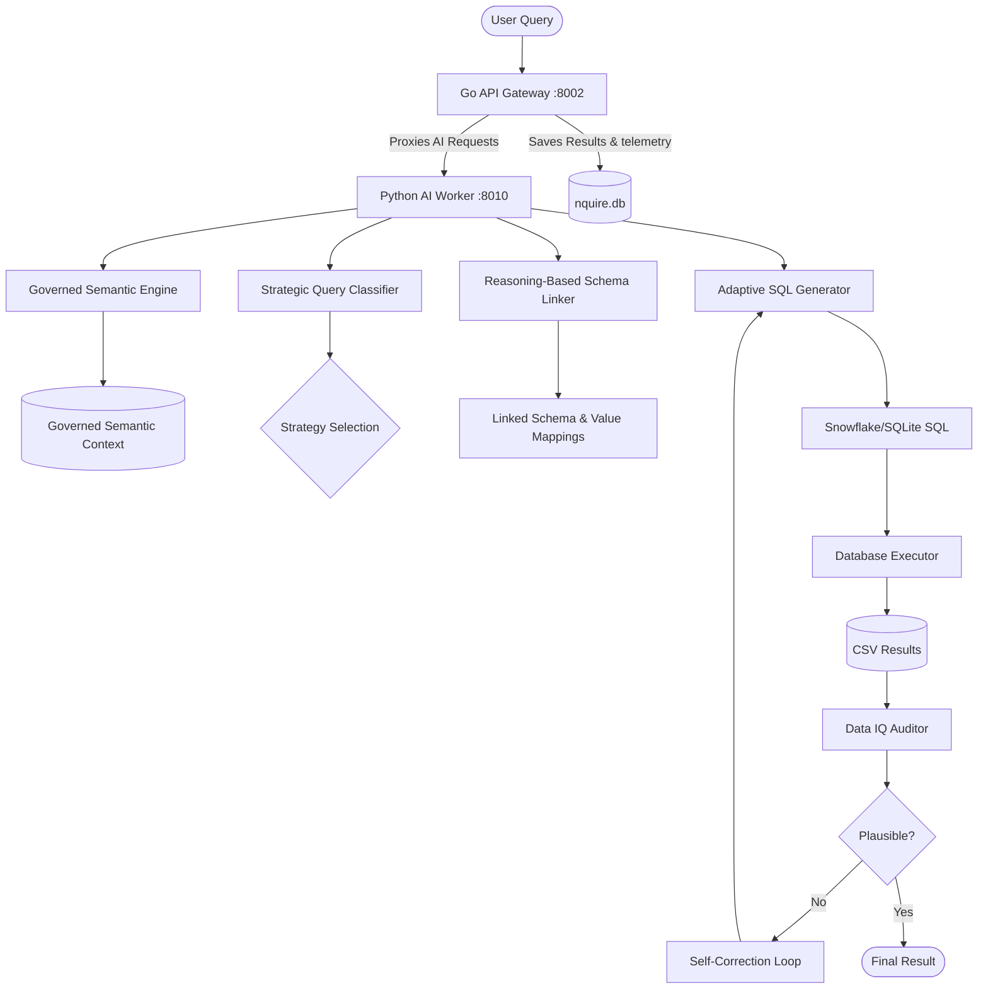

# Semantic DIN-SQL: Deterministic, Reasoning-First Text2SQL Microservices

Semantic DIN-SQL is a high-precision, domain-agnostic Text2SQL pipeline designed for Snowflake and SQLite database analysis. It replaces fragile, hardcoded heuristics with a **Reasoning-First** architecture that prioritizes data fidelity, relational depth, and automated quality validation. 

Now refactored into a high-performance **Microservices monorepo**, the project features a compiled Go API Gateway, a Python LLM Reasoning Worker, a modern React/Vite dashboard, and a pre-configured Prometheus/Grafana observability stack.

---

## 🏗️ Repository Reorganization

The workspace is organized into separate, highly-focused microservices:

```
TT_SQL_V2/
├── backend/
│   ├── gateway/          # [Go] API Gateway (port 8002) - CRUD, SQLite DB stats, Prometheus exporter & LLM proxying.
│   └── agent/            # [Python] AI/ML worker (port 8010) - LLM reasoning, schema linkers, self-improving agent loop.
│       ├── agent/        # Python source package (app/, config/, resources/, results/)
│       ├── venv_new/     # Python local virtual environment
│       └── requirements.txt
├── frontend/             # [React/Vite] UI dashboard (interacts with gateway via port 8002)
├── monitoring/           # Prometheus and Grafana service telemetry configurations
└── .env                  # Global environment configuration (port overrides, credentials)
```

---

## 🧠 Core Architecture

The generation flow follows a modular, iterative reasoning paradigm designed to eliminate hallucinations:



1. **Governed Semantic Engine**: Automatically extracts metadata and matches values from SQLite or Snowflake databases.
2. **Reasoning-Based Schema Linker**: Binds query terms to precise database columns using real value-lookup matches.
3. **Strategic Query Classifier**: Categorizes user questions into `easy`, `non_nested_complex`, or `nested_complex` to select the optimal LLM generation prompt/strategy.
4. **Adaptive SQL Generator**: Formulates compliant SQL, hardened for complex joins, window functions, and JSON/VARIANT flattened attributes.
5. **Data IQ Auditor**: Conducts execution-based exploratory analysis (mini-EDA) checking for null ratios, row limits, schema mismatches, and empty outputs.
6. **Self-Correction Loop**: Catches execution or logic errors and feeds traceback reports back to the generator for automated self-healing.

---

## 🚀 Getting Started

Ensure you have the following runtimes installed:
- **Go** (v1.22+)
- **Python** (v3.10+)
- **Node.js** (v18+)
- **Docker** & **Docker Compose** (optional, for monitoring)

### 1. Global Configuration

Create a `.env` file in the project root:
```env
# Amazon Bedrock LLM Credentials
BEDROCK_ACCESS_KEY_ID="your_access_key"
BEDROCK_SECRET_ACCESS_KEY="your_secret_key"
BEDROCK_REGION="us-east-1"
LLM_PROVIDER="bedrock"
LLM_MODEL="bedrock/openai.gpt-oss-safeguard-120b"

# LangSmith Tracing (Optional)
LANGCHAIN_TRACING_V2="true"
LANGCHAIN_API_KEY="your_langchain_key"
LANGCHAIN_PROJECT="TT_SQL_V2"

# Microservices Ports Setup
GO_PORT=8002
PYTHON_PORT=8010
PYTHON_API_URL=http://localhost:8010
```

### 2. Python AI/ML Worker Setup

```bash
# Navigate to the Python agent workspace
cd backend/agent

# Create and activate virtual environment
python -m venv venv_new
venv_new\Scripts\activate      # On Windows PowerShell/CMD
source venv_new/bin/activate    # On Linux/macOS

# Install agent dependencies
pip install -r requirements.txt
```

Start the Python service:
```bash
# Run from backend/agent directory with PYTHONPATH=.
$env:PYTHONPATH="."
venv_new\Scripts\python.exe agent/app/api.py
```
The server will start on port `8010` (by default).

### 3. Go API Gateway Setup

```bash
# Navigate to the Go gateway directory
cd backend/gateway

# Run directly
go run cmd/server/main.go

# Or compile and build executable
go build -o gateway.exe cmd/server/main.go
.\gateway.exe
```
The gateway will start on port `8002` (by default) and auto-detect your `.env` ports. It connects to the local database at `backend/agent/agent/results/evaluations/nquire.db` for storing session metadata and evaluation diagnostics.

### 4. Frontend Dashboard Setup

```bash
# Navigate to the frontend directory
cd frontend

# Install Node dependencies
npm install

# Run the development server
npm run dev
```
Open [http://localhost:5173](http://localhost:5173) in your browser to view the interactive dashboard.

### 5. Prometheus & Grafana Monitoring

To view Go API endpoints, latency statistics, and error rates:
```bash
# Start the monitoring stack
cd monitoring
docker-compose up -d
```
- **Prometheus**: Accessible at `http://localhost:9090` (polls the Gateway's `/metrics` endpoint).
- **Grafana**: Accessible at `http://localhost:3000` (pre-configured with dashboards).

---

## 🛠️ Running the Pipeline & Scripts

Core scripts should be run from the python agent root directory (`backend/agent`) with the virtual environment activated:

```bash
cd backend/agent
$env:PYTHONPATH="."
```

#### Run Batch Processing
Executes a batch of Text2SQL evaluation queries against a specific target benchmark database.
```bash
venv_new\Scripts\python.exe agent/scripts/run_batch.py --instance sf_bq070
```

#### Run Self-Improvement Loop
Iterates over SQL compilation and data quality failures, refining SQL generator rules dynamically based on execution results.
```bash
venv_new\Scripts\python.exe agent/scripts/run_self_improve.py
```

#### Compile Evaluation Submissions
Compiles generated SQL structures and extracts answers into a consolidated zip bundle.
```bash
venv_new\Scripts\python.exe agent/scripts/compile_submission.py
```

---

## 💎 Design Philosophy: "NO Hardcoding"

Every prompt, link, and agent logic in Semantic DIN-SQL is decoupled from domain-specific rules. It supports multi-tenant datasets (clinical, financials, patent metrics, yelp queries) out-of-the-box by relying on:
- **Evidence-Based Grounding**: Scanning actual database profiles and samples rather than guessing.
- **Structural Strategy**: Mapping queries via complexity templates rather than hardcoded columns.
- **Execution Validation**: Query results are dynamically profiled by the Data IQ Layer to ensure logical validation before completion.


## MAIN GOAL

Our goal is 100% generic pipeline that works on any DB and any diaelect (dialects should be learnable and non diverging) with 0% bias, minimal latency (< 60s), 100% purely non blocking fast and scalable services, 0% erroring, 0% exceptions, 100% stable and deterministic, maximum accurate sql generation, world class architecture, minimal tokens, 0 hardcoding, 0 leakage of gold truth into pipeline, 100% pure reasoning and fast inference, fast caching wherever necessary, KV cahing may be and no duplicates, 0 warnings in the pipeline run, 100% strong self learning, 0% leakage of prompts, 0 failures of prompt injestion, prompt monitoring, grounded agent analytics, 0% redundant checks, 100% data quality checks at every step, 100% sql validation  etc etc you can improvise this more and make this list even bigger, But i think you understood our main/most and utmost important goals, so please make sure these are met strictly and reverified atleast on 5 failed queries it's a must in the evaluation time.

With each run our pipeline should only get better and better and converging and improving accuracy. Must and should be self learning to that level. With each failure it should learn and improvise and grow stronger and more intelligent. It should be so strong that even after 1000s of runs it doesnt fail and it keeps on learning and improvising and growing stronger and more intelligent. 

With 0 hallucinations with 0 fabrication with 0 guess works at any stage. It should be so deterministic that even after 1000s of runs it gives same sql query for same question with same db. The only thing that can change is the accuracy of the sql query and it should keep improving with each run. 

All these have to be implemented at highest world class quality.