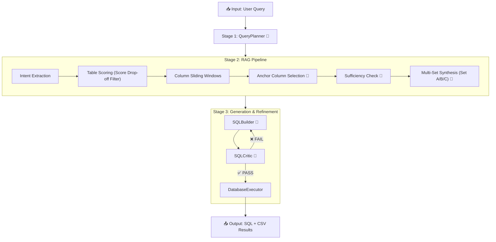

# TT_SQL: nQuiry Text2SQL Agent

nQuiry is an industry-grade Text-to-SQL engine that converts natural language questions into executable SQL queries with high precision. It uses a **layered multi-agent architecture** to analyze, plan, generate, critique, and refine SQL queries iteratively.

## ✨ Key Features

- **Layered Flow**: 4-stage pipeline (Planning → Context Enrichment/RAG → Generation → Execution).
- **Anchor-Driven RAG**: Advanced sliding-window retrieval that identifies core "anchor" columns first, then builds complete schema context via sibling expansion.
- **Self-Correction Loop**: SQLCritic validates logic and syntax; SQLBuilder auto-refines on failure (up to 5 retries).
- **HTTP/REST Qdrant Interface**: Direct, lightweight integration with Qdrant Cloud without SDK overhead.
- **Batch Processing**: High-performance parallel batch runner for large-scale evaluation.
- **Safe Execution**: Only executes `SELECT` statements against target databases.

---

## 🏗️ Architecture Overview



> 🤖 = LLM call (Amazon Bedrock / Claude 3.5 Sonnet)

### Agent Summary

| # | Agent | File | LLM? | Purpose |
|---|-------|------|------|---------|
| 1 | `QueryPlanner` | `planning_layer.py` | **Yes** | Breaks natural language into a logical step-by-step action plan. |
| 2 | `TableSelector` | `input_layer.py` | No* | Orchestrates RAG calls to build the schema context. |
| 3 | `VectorStoreAgent` | `rag/vector_store.py` | **Yes** | Executes Anchor-Driven RAG with sliding windows and sufficiency checks. |
| 4 | `SQLBuilder` | `generation_layer.py` | **Yes** | Generates SQL from the plan, RAG schema, and critic feedback. |
| 5 | `SQLCritic` | `critic_layer.py` | **Yes** | Performs logic and syntax critique on generated SQL. |
| 6 | `PostgresExecutor` | `execution_layer.py` | No | Executes final SQL and saves results/logs. |
| 7 | `RefinementLoop` | `loop_layer.py` | No | Orchestrates the Builder-Critic iterative loop. |

---

## 🚀 Getting Started

### 1. Prerequisites
- **Python 3.10+**
- **Qdrant Cloud** (or Local) for vector storage
- **AWS Bedrock** credentials (Claude 3.5 Sonnet / Titan)

### 2. Installation
```bash
git clone https://github.com/NG-VikasV/TT_SQL.git
cd TT_SQL
python -m venv venv
# Windows: .\venv\Scripts\activate | Mac/Linux: source venv/bin/activate
pip install -r requirements.txt
```

### 3. Configuration (.env)
```ini
# LLM
LLM_MODEL=bedrock/anthropic.claude-3-5-sonnet-20240620-v1:0
AWS_ACCESS_KEY_ID=xxx
AWS_SECRET_ACCESS_KEY=xxx
AWS_REGION=us-east-1

# Qdrant
QDRANT_URL=https://your-qdrant-cluster.aws.cloud.qdrant.io
QDRANT_API_KEY=your-api-key
QDRANT_COLLECTION=your-collection-name
```

---

## 🏃‍♂️ Usage

### Pre-generating RAG Schemas
Before running the full pipeline, generate the schema JSONs for your dataset:
```bash
python scripts/generate_rag_schemas.py --dataset data/sample.jsonl
```

### Running a Single Instance
```bash
python scripts/run_single.py --id q001 --dataset data/sample.jsonl --use-rag
```

### Batch Processing
```bash
python scripts/run_batch.py --dataset data/sample.jsonl --workers 10 --use-rag
```

---

## 📂 Project Structure

```text
TT_SQL/
├── ARCHITECTURE.md           # Detailed pipeline logic & Mermaid diagrams
├── scripts/                  # CLI Entry Points
│   ├── generate_rag_schemas.py # RAG pre-generation tool
│   ├── run_single.py         # Single question runner
│   ├── run_batch.py          # Parallel dataset runner
│   └── populate_vector_store.py # Ingestion utility
├── data/                     # Metadata & Datasets
│   ├── sample.jsonl          # Main test questions
│   ├── metadata_injestion_files.json # Schema metadata
│   └── domain_map.json       # Table allowlists
├── src/tt_sql/               # Core Package
│   ├── agents/               # Planner, Builder, Critic, RAG agents
│   ├── core/                 # Orchestrator, State, LLM Service
│   └── rag/                  # VectorStoreAgent (HTTP REST)
└── results/                  # [Generated] sql, csv, logs, schemas
```

---

## 📄 License
Research and Educational purposes. Developed for industry-grade text-to-SQL logic.
