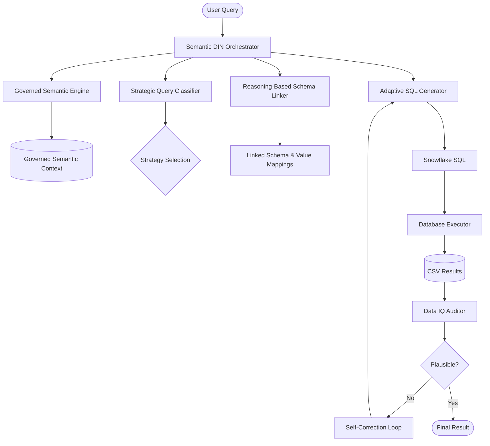

# Semantic DIN-SQL: Deterministic, Reasoning-First Text2SQL

Semantic DIN-SQL is a high-precision, domain-agnostic Text2SQL pipeline designed for Snowflake. It replaces fragile, hardcoded heuristics with a "Reasoning-First" architecture that prioritizes data fidelity, relational depth, and automated quality validation.

## 🏗️ Project Structure

This repository is built as a full-stack application with a Python multi-agent backend and a modern React/Vite frontend.

- **`backend/`**: Contains the core Python multi-agent pipeline, orchestration rules, and database execution logic.
- **`frontend/`**: Contains a modern React, Vite, and Tailwind CSS dashboard for interacting with the semantic engine and exploring schema mappings.

## 🧠 Core Architecture

The pipeline follows a modular, iterative flow designed to eliminate hallucinations and ensure execution success:



1. **Governed Semantic Engine**: Automatically extracts and builds a "Semantic Context" from database metadata, including descriptions and actual data samples.
2. **Reasoning-Based Schema Linker**: Maps terms to columns based on exact sample matches and automatically identifies complex categorical filters.
3. **Strategic Query Classifier**: Classifies query complexity (`easy`, `non_nested_complex`, `nested_complex`) to select the optimal generation strategy.
4. **Adaptive SQL Generator**: Snowflake-native generator hardened for `VARIANT`/`JSON` handling using `LATERAL FLATTEN`. Ensures FQN compliance.
5. **Data IQ Layer (EDA Validation)**: Analyzes execution results using mini-EDA (duplicate counts, null percentages, empty-string detection).
6. **Self-Correction Loop**: An iterative feedback loop that repairs both compilation errors (syntax) and data quality failures (logic).

## 🚀 Getting Started

### 1. Backend Setup (Python)

Ensure you have a modern Python environment installed.

```bash
# Create and activate your virtual environment
python -m venv venv_new
venv_new\Scripts\activate  # On Windows

# Install dependencies
pip install -r requirements.txt
```

**Configuration:**
Create a `.env` file at the root of the project with your Bedrock credentials:
```env
BEDROCK_REGION=us-east-1
BEDROCK_SECRET_ACCESS_KEY=your_key
LLM_MODEL=bedrock/openai.gpt-oss-safeguard-120b
```

### 2. Frontend Setup (React/Vite)

Navigate to the frontend directory to install dependencies and run the UI.

```bash
cd frontend
npm install
npm run dev
```

## 🛠️ Running the Pipeline

You can run the core pipeline scripts from the project root using the `backend/scripts` path. Ensure you set your `PYTHONPATH` first.

```bash
# Set PYTHONPATH to root for imports (Windows PowerShell)
$env:PYTHONPATH = ".;" + $env:PYTHONPATH
```

**Core Execution Scripts:**

- **Run Batch Processing:**
  Execute a batch of queries against the database instance.
  ```bash
  python backend/scripts/run_batch.py --instance sf_bq070
  ```

- **Compile Submissions:**
  Compile final SQL outputs for evaluation/submission.
  ```bash
  python backend/scripts/compile_submission.py
  ```

- **Run Self-Improvement Loop:**
  Execute the iterative self-improving pipeline to refine generated SQL logic based on execution failures.
  ```bash
  python backend/scripts/run_self_improve.py
  ```

## 💎 Design Philosophy: "NO Hardcoding"
Every prompt and module in this repository is strictly decoupled from domain-specific terminology. Whether processing Clinical (IDC), Intellectual Property (Patents), or Financial data, the system relies on:
- **Evidence-Based Grounding**: Using actual database samples to justify mapping.
- **Architectural Principles**: Using structural rules rather than hardcoded column lists.
- **Automated IQ**: Using the Data IQ layer to "feel" if a result is correct, mimicking human data validation.

---
*Built for high-precision Snowflake benchmarks (Spider2.0).*
