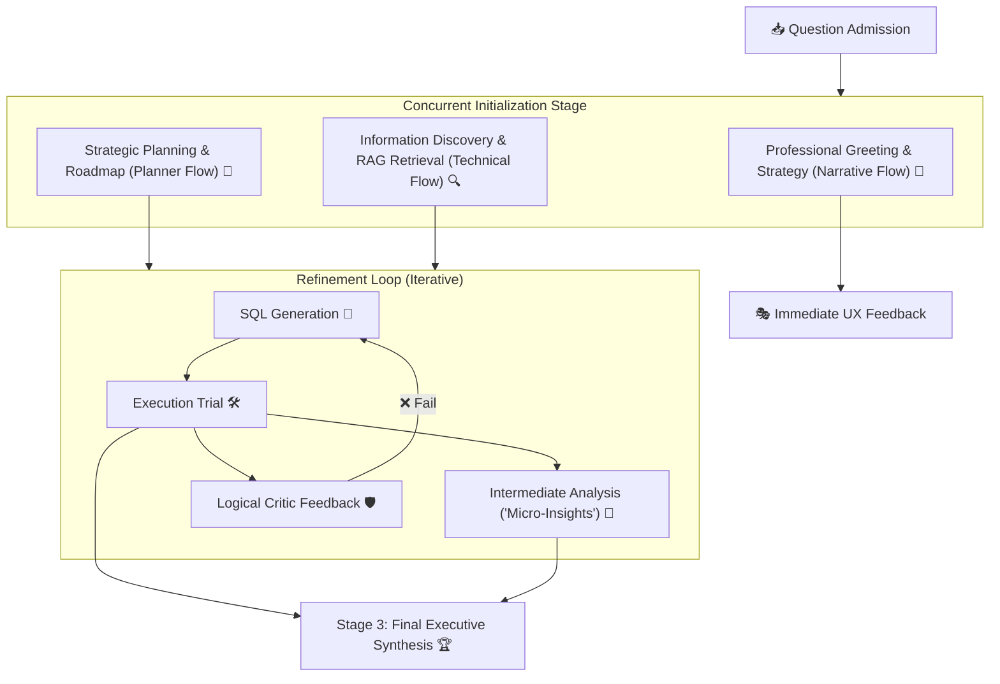

# nQuire: Modular & Parallel Architecture

nQuire is built on a high-performance **Concurrent Multi-Agent Pipeline**. It prioritizes user experience by separating business narratives from heavy technical computation.

---

## 🚀 The Multi-Flow Architecture

Unlike traditional sequential chains, nQuire executes three independent "flows" to maximize efficiency:

---

## 🛡️ Layered System Design

We adhere to the **Controller-Service-Repository** pattern to ensure clean separation of concerns.

### 1. Presentation Layer (Controllers)
- **File**: `app/controllers/query_controller.py`
- **Role**: Entry point for API requests. Supports both standard JSON responses and **SSE (Server-Sent Events)** for real-time streaming.

### 2. Business Logic Layer (Services)
- **Pipeline Service**: `app/services/pipeline_service.py`
- **Role**: Orchestrates the agents using a `ThreadPoolExecutor`. Management of state transitions and background narrative threads happens here.

### 3. Agent Layer (Intelligence)
- **Agents**: `app/services/agents/`
- **Planner**: Deconstructs complex questions into analytical roadmaps.
- **RAG Expert**: Consolidates schema retrieval into a single, high-context LLM pass.
- **Builder**: Translates requirements into precision-engineered SQL.
- **Critic**: Performs logical and technical validation against the database execution results.

### 4. Data Access Layer (Repositories)
- **RAG Repository**: `app/repos/rag/query_qdrant.py`
- **Database Repository**: `app/repos/db_executor.py`
- **Role**: Heavy-lifting retrieval from vector databases (Qdrant) and terminal execution against relational databases (PostgreSQL/SQLite).

---

## 📈 Optimization Highlights

1. **Turbo Streaming**: ACHIEVED < 2.0s TTFT by launching the Orchestrator Greeting simultaneously with technical discovery.
2. **RAG Expert**: Consolidated column retrieval into 1 LLM call, reducing baseline latency by 75% for complex schemas.
3. **Background Narratives**: Intermediate business insights are generated in non-blocking threads, ensuring the technical pipeline never "waits" for the advisor to finish speaking.
