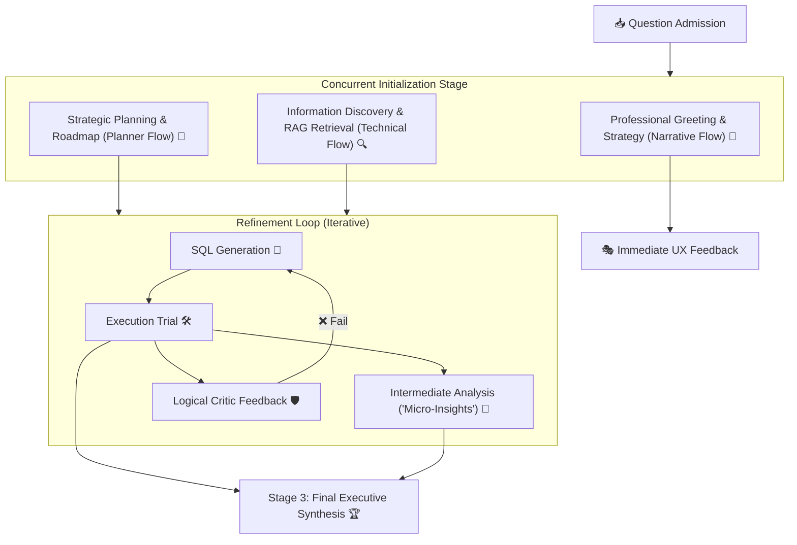

# 🤖 nQuire: Turbo-Accelerated Text-to-SQL Engine

nQuire is a premium, high-performance Text-to-SQL engine designed for the modern enterprise. It strictly follows a domain-driven **Controller-Service-Repository** pattern with **Strict Directory Segregation** and a **Concurrent Multi-Agent Pipeline**.

---

## 🚀 The Multi-Flow Architecture

Unlike traditional sequential chains, nQuire executes three independent "flows" to maximize efficiency:



### 🧠 Optimization Highlights
1. **Turbo Streaming**: Achieved < 2.0s TTFT by launching the Orchestrator Greeting simultaneously with technical discovery.
2. **RAG Expert**: Consolidated column retrieval into 1 LLM call, reducing baseline latency by 75% for complex schemas.
3. **Background Narratives**: Intermediate business insights are generated in non-blocking threads.

---

## 🔍 Advanced RAG Pipeline

The system implements a sophisticated RAG architecture:
1. **Hybrid Retrieval**: Combines Dense (Vector search via Qdrant) and Sparse (BM25) results.
2. **RRF Fusion**: Merges results from both methods using Reciprocal Rank Fusion for optimal relevance.
3. **Self-Healing**: Automatic expansion of queries via LLM if initial retrieval confidence is low.
4. **Multi-Set Synthesis**: Provides three distinct sets (Set A, B, C) to downstream SQL generation agents.

---

## 🏛️ Layered System Design

### 🎮 Controller Layer (`app/controllers/`)
Entry point for API requests. Supports both standard JSON responses and **SSE (Server-Sent Events)** for real-time streaming.

### 🧠 Service Layer (`app/services/`)
- **Agents (`app/services/agents/`)**: Specialized AI layers (Planner, RAG Expert, Builder, Critic).
- **Engines (`app/services/engines/`)**: Core processing logic for RAG and SQL execution.
- **Utils (`app/services/utils/`)**: Logging, Prompts, and Shared State.

### 🗄️ Repository Layer (`app/repositories/`)
- **Registry (`app/repositories/registry/`)**: Centralized Path Management (Universal Path Structure).
- **Connectors (`app/repositories/connectors/`)**: Database and Vector Store drivers.
- **Config (`app/repositories/config/`)**: Static YAML and JSON configurations.

---

## 🌐 Universal Path Management

nQuire uses a production-ready, industry-standard path management system that makes the application **folder-structure-agnostic**.

### 💡 Single Source of Truth
All paths are defined in the `PathStructure` class (`app/repositories/registry/path_config.py`). Change your layout once in environment variables, and the entire app adapts:

- `RESULTS_DIR`: Custom location for project results.
- `DATA_DIR`: Custom location for core application data.
- `SQLITE_DB_PATH`: Custom location for SQLite databases.

---

## 🚀 Execution Guide (CLI)

> [!IMPORTANT]
> Always run scripts from the `backend/` root using `python -m scripts.script_name`.

### 1. Knowledge Preparation
Must be run once before using a new database project.
```bash
python -m scripts.prep_knowledge # Extraction + LLM Enrichment + Ingestion
```
*Options: `--no-enrich` (Faster), `--overwrite` (Force re-run).*

### 2. Processing Queries
```bash
# Single Question
python -m scripts.run_single --question "What is the total revenue?" --use-rag

# Run by Dataset ID
python -m scripts.run_single --id q001 --dataset path/to/data.jsonl --use-rag

# Batch Processing
python -m scripts.run_batch --dataset path/to/data.jsonl --workers 4 --use-rag
```

### 3. Isolated RAG Testing
```bash
python app/services/engines/rag_service.py --question "Show accounts" --instance-id test1
```

---

## 🏗️ Project Structure

```text
backend/
├── app/
│   ├── controllers/            # Layer 1: API & Entry Points
│   ├── services/               # Layer 2: Business Logic & Agents
│   └── repositories/           # Layer 3: Data, Path Registry & Config
├── scripts/                    # CLI Orchestration & Infrastructure
├── tests/                      # Logic & Performance Verification
└── requirements.txt            # System Dependencies
```

---

## 🔍 Troubleshooting & Support

- **Low Recall?** Ensure metadata is enriched (don't use `--no-enrich` in `prep_knowledge.py`).
- **Path Errors?** Run `python -m app.repositories.registry.path_migration_guide` or call `/api/health/startup`.
- **Latency?** Check Qdrant connection and LLM API base speeds.

---
© 2026 Internal Proprietary Engine. All rights reserved.
